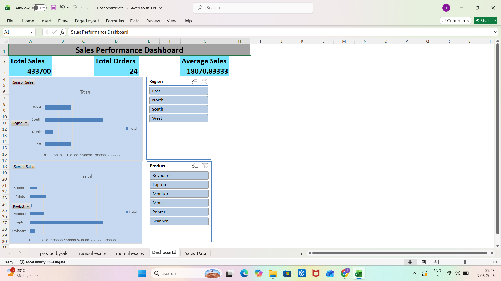

# Excel_Data_Cleaning_and_Reporting_Dashboard
Excel Dashboard Project using Data Cleaning, Pivot Tables, Charts, and Slicers

# Excel Data Cleaning & Reporting Dashboard

## Project Overview
Created an interactive Excel dashboard using data cleaning, Pivot Tables, Pivot Charts, and Slicers.

## Tools Used
- Microsoft Excel
- Pivot Tables
- Pivot Charts
- Slicers
- Conditional Formatting
- Data Validation

## Dashboard Preview

## Features
- Data Cleaning
- Duplicate Removal
- Missing Value Handling
- Region-wise Sales Analysis
- Product-wise Sales Analysis
- KPI Cards
- Interactive Dashboard

## Files
- Data_Cleaning_Dashboard_Project.xlsx
- Exceldashboard_screenshot.png
  
